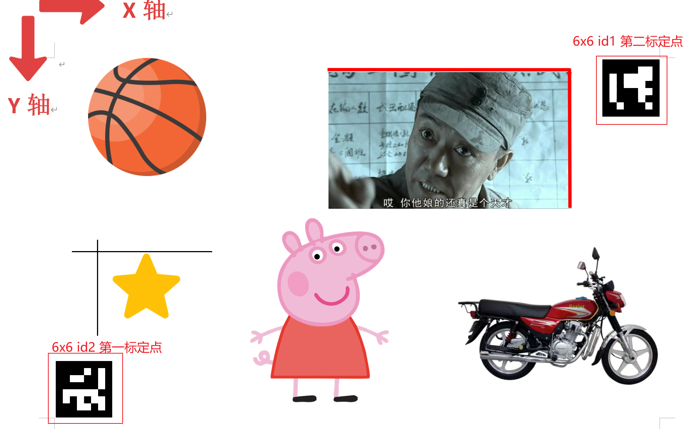

# Mycobot Plus AI Agent

基于[同济子豪兄大象机械臂Mycobot 280 Pi教程](https://github.com/TommyZihao/Mycobot_Tutorials.git) 项目开发。

作为机械臂以及ROS零基础的小白，这个项目无疑是具有难度，不过最终还是成功运行，并修改和加入了一些东西。希望该项目对你有帮助！

不同点：

- 使用夹爪而非吸泵
- 没有连接树梅派
- 添加标定助手:`calibration_assist.py`，辅助手眼标定
- 修改agent：
  - 目前共有三类agent:
    - control_agent：生成控制代码，并运行，实现机械臂控制
    - llm_led：根据提示改变机械臂led灯颜色
    - detection_agent：识别目标的位置
- 将重要参数写入配置文件中，方便修改

## Get Started

系统：ubuntu20.04.1

机械臂: Mycobot 280 m5

### Installation

```
conda create -n mycobot python=3.11 && conda activate mycobot
```

> 最好不要折腾系统的python，关于conda的安装见tips.md

```
pip install -r requirements.txt
```

> PyAudio 可能无法安装成功，执行以下命令：
>
> ```
> sudo apt-get install python-all-dev 
> sudo apt-get install portaudio19-dev
> ```
>
> 然后再
>
> ```
> pip install pyaudio
> ```

### Configuration

#### [DEFAULT]

把`config.ini.template`修改为`config.ini`，并在`YOUR_API_TOKEN`，填入你的API_TOKEN，`dev_video`填入机械臂摄像头设备号，`MYCOBOT_BAUD`一般不需要修改。

```
#查看机械臂摄像头设备号
ls /dev/video*
#查看机械臂端口号
ls /dev/ttyACM*
#or
ls /dev/ttyUSB*
```

> windows要安装驱动参考：https://docs.elephantrobotics.com/docs/mycobot-m5-cn/4-BasicApplication/4.1-myStudio/4.1.1-myStudio_download_driverinstalled.html

修改机械臂端口权限

```
sudo chmod a+rw /dev/ttyACM0 #改成你的设备号
```

#### [Carlibration]

不需要修改

#### [MYCOBOT]

**这一部分要通过实际调试后写入**

`top_view_angles`，是机械臂俯身拍摄时机械臂的角度;`HEIGHT_END` 是机械臂下降到抓取位置的高度 ;`HEIGHT_SAFE`是机械臂上升到搬运位置的高度;`COORDS_R`是移动到指定坐标时的rx,ry,rz值

```
mc.send_angles([0, 0, 0, 0, 0, 0], 40)#机械臂归零
mc.release_all_servos()#释放所有关节
mc.release_servo(1)#释放关节1
mc.get_angles()#获取角度
mc.get_coords()#获取当前机械臂末端的x,y,z,rx,ry,rz,其中z就是高度
```

### Usage

打印彩纸，确保左下角aruco码为6x6，id2，左上角为6x6,id1，同时两aruco必须都出现在画面中，否则会识别不成功。参考或直接使用asset下的彩纸打印。

> aruco码生成网站：https://chev.me/arucogen/

面对机械臂屏幕方向为x轴，彩纸按方向放好。运行程序：

```
python run.py
```

> 出现title为can't find aruco的画面是因为找不到aruco码，或aruco码没按规则摆放

其中标定点1为左下角aruco码，标定点为右上角aruco码



> 标定时确保机械底座位置不能改变，释放机械臂时记得扶好机械臂
>
> 完成一次标定后，只要机械臂彩纸位置不变可不用再标定

> 由于我的机械臂第四关节常常有无法保持的情况，导致在目标检测，拍摄俯视图时会有拍摄不到彩纸的情况，因此每次拍摄都强制检测两端的aruco码是否存在。

### example

使用默认命令，且已完成一次标定

命令行输出：

```
机械臂归零
移动至俯视姿态
是否进行机械臂标定，输入'n'取消:n
将从配置文件中读取，请确保点位正确
标定完成
是否开启录音，按r开始录制，按k打字输入，按c输入默认指令:c

******Agent智能体启动******


******Agent智能体编排任务******

解析成功！llm生成任务如下：
[
    {
        "task_id": "1",
        "dependent_task_ids": [],
        "instruction": "回到原点",
        "task_type": "control"
    },
    {
        "task_id": "2",
        "dependent_task_ids": [
            "1"
        ],
        "instruction": "对包装盒进行目标检测",
        "task_type": "detection"
    },
    {
        "task_id": "3",
        "dependent_task_ids": [
            "2"
        ],
        "instruction": "对小猪佩奇进行目标检测",
        "task_type": "detection"
    },
    {
        "task_id": "4",
        "dependent_task_ids": [
            "3"
        ],
        "instruction": "将包装盒放到小猪佩奇上",
        "task_type": "control"
    }
]
执行任务 1: 回到原点, 类型: CONTROL

******control智能体执行动作******

0001: from pymycobot.mycobot import MyCobot
0002: from utils.robot import *
0003: mc = MyCobot('/dev/ttyACM0',115200)
0004: back_zero(mc)
0005: 

执行任务 2: 对包装盒进行目标检测, 类型: DETECTION

******detection智能体执行动作******

拍摄俯视图
机械臂归零
移动至俯视姿态
机械臂归零
移动至俯视姿态
    保存至temp/vl_now.jpg
将图片输入给多模态视觉大模型
    尝试第 1 次访问多模态大模型
未找到 JSON 内容
[
    {
        "name": "包装盒",
        "top_left": [667, 615],
        "right_bottom": [999, 859]
    }
]
    尝试修复
    修复成功
    多模态大模型调用成功！
{'包装盒': (95, -204)}
执行任务 3: 对小猪佩奇进行目标检测, 类型: DETECTION

******detection智能体执行动作******

拍摄俯视图
机械臂归零
移动至俯视姿态
未识别到aruco码
未识别到aruco码
未识别到aruco码
未识别到aruco码
未识别到aruco码
未识别到aruco码
未识别到aruco码
未识别到aruco码
未识别到aruco码
未识别到aruco码
未识别到aruco码
未识别到aruco码
未识别到aruco码
未识别到aruco码
未识别到aruco码
未识别到aruco码
未识别到aruco码
未识别到aruco码
未识别到aruco码
未识别到aruco码
机械臂归零
移动至俯视姿态
未识别到aruco码
    保存至temp/vl_now.jpg
将图片输入给多模态视觉大模型
    尝试第 1 次访问多模态大模型
未找到 JSON 内容
[
    {
        "name": "小猪佩奇",
        "top_left": [355, 489],
        "right_bottom": [577, 877]
    },
    {
        "name": "篮球",
        "top_left": [129, 125],
        "right_bottom": [297, 390]
    },
    {
        "name": "星星",
        "top_left": [119, 543],
        "right_bottom": [232, 663]
    },
    {
        "name": "警告",
        "top_left": [722, 691],
        "right_bottom": [990, 821]
    }
]
    尝试修复
    修复成功
    多模态大模型调用成功！
{'包装盒': (95, -204), '小猪佩奇': (1, -195)}
{'包装盒': (95, -204), '小猪佩奇': (1, -195), '篮球': (-63, -120)}
{'包装盒': (95, -204), '小猪佩奇': (1, -195), '篮球': (-63, -120), '星星': (-72, -181)}
{'包装盒': (95, -204), '小猪佩奇': (1, -195), '篮球': (-63, -120), '星星': (-72, -181), '警告': (101, -208)}
执行任务 4: 将包装盒放到小猪佩奇上, 类型: CONTROL

******control智能体执行动作******

0001: from pymycobot.mycobot import MyCobot
0002: from utils.robot import *
0003: mc = MyCobot('/dev/ttyACM0',115200)
0004: # 假设mc是机械臂的实例
0005: 
0006: # 0. 一开始机械臂位置要归零
0007: back_zero(mc)
0008: 
0009: # 1. 打开夹爪
0010: gripper_open(mc)
0011: 
0012: # 2. 移动到包装盒的位置，并下降到夹取物体时的安全高度
0013: move_to_coords(mc, X=95, Y=-204)
0014: grip_END_SAFE(mc)
0015: 
0016: # 3. 关闭夹爪，夹住包装盒
0017: gripper_grip(mc)
0018: 
0019: # 4. 夹爪上升到搬运途中的安全高度
0020: grip_HEIGHT_SAFE(mc)
0021: 
0022: # 5. 移动到小猪佩奇的位置
0023: move_to_coords(mc, X=1, Y=-195)
0024: 
0025: # 6. 下降到放置物体的高度
0026: grip_END_SAFE(mc)
0027: 
0028: # 7. 放开夹爪，放置物体
0029: gripper_open(mc)
0030: 
0031: # 8. 夹爪上升到搬运途中的安全高度
0032: grip_HEIGHT_SAFE(mc)
0033: 

执行完成
```

机械臂运行视频：没有录

## what's more

[tips.md](https://github.com/GG-Lizen/Mycobot-plus-AI-Agent/blob/main/tips.md)包含：ROS安装，相机内参标定，安装moveit，安装mycobot_ros

> rospy不支持 python3.11

# 存在的问题

- cv2多进程
  - 如何设计使得可以流畅的展示画面又不影响获取最新的帧
- 语音识别不准确
- 路径规划问题，先移动到xy坐标再下降到z坐标，可能导致机械臂超出限位
  - 目前解决方法：先下降一定高度
- 未考虑识别物体不存在问题
